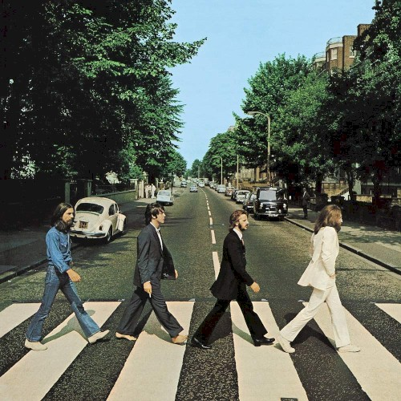
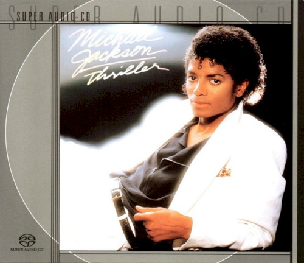
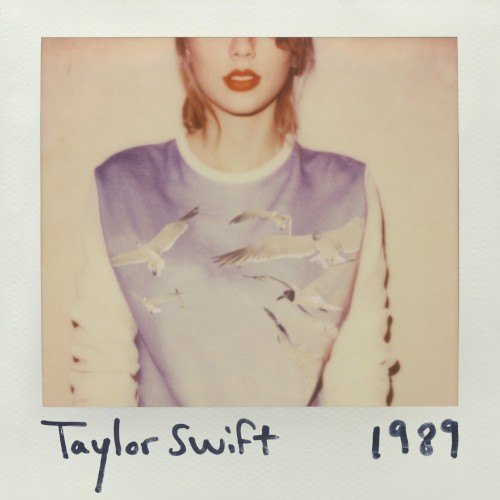
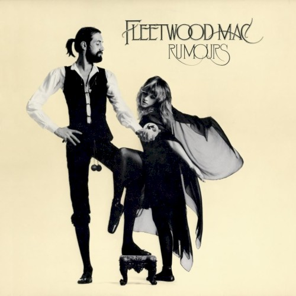
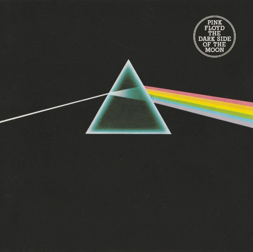

Welcome to our album collection! Click on any album cover to view it in full screen and cycle through the gallery.

::: {layout-ncol=3}
{group="albums" description="The Beatles – Abbey Road (1969)"}

{group="albums" description="Michael Jackson – Thriller (1982)"}

{group="albums" description="Taylor Swift – 1989 (2014)"}

{group="albums" description="Fleetwood Mac – Rumours (1977)"}

{group="albums" description="Pink Floyd – The Dark Side of the Moon (1973)"}

{group="albums" description="Beyoncé – Renaissance (2022)"}

{group="albums" description="Adele – 21 (2011)"}

{group="albums" description="Kendrick Lamar – To Pimp a Butterfly (2015)"}

{group="albums" description="David Bowie – The Rise and Fall of Ziggy Stardust (1972)"}

{group="albums" description="Billie Eilish – When We All Fall Asleep, Where Do We Go? (2019)"}
:::
